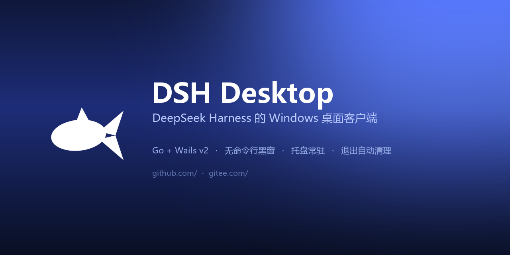
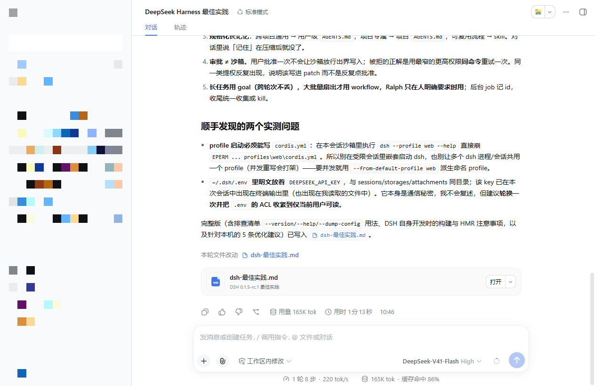

# DSH Desktop (Go)

[](LICENSE)
[](#requirements)
[](https://go.dev)
[](https://wails.io)

**Turns the DeepSeek Harness web UI into a double-click Windows desktop app.**

No terminal, no command to remember, no console window hanging around. Closing the window just tucks it into the system tray; you quit from the tray menu.

[简体中文](README.md) · English · [GitHub](https://github.com/Echosong/dsh-desktop-go) · [Gitee](https://gitee.com/hn-1024_0/dsh-desktop-go)

---

## The problem

To use dsh you run `dsh web` in a terminal, then copy the token-bearing URL it prints into a browser. Every time. You can't just bookmark that URL, because the token in it is per-process — it changes on every dsh restart.

So this shell does it for you: double-click the icon, it launches dsh, waits until the UI has actually connected, then swaps the window over. Nothing visible runs in the background, and nothing is left behind when you quit.

## Features

- **Double-click and go** — launches `dsh web`, waits until the Web UI has really connected before showing the window. No white flash, no error page.
- **No console windows** — dsh and every internal command run with `CREATE_NO_WINDOW`; you won't see a black window in Task Manager.
- **Lives in the tray** — the close button just hides the window; left-click the tray icon to bring it back, right-click to quit.
- **No orphan processes** — a Windows Job Object guarantees dsh dies with the app, even if the app crashes or is force-killed.
- **Never touches your API key** — it neither reads nor stores any model credentials (see [Credentials](#credentials)).

> **This is more than a dsh wrapper.** If you want to package **any** web service running on `localhost` (Ollama, Jupyter, a local dashboard…) as a desktop app, the startup sequencing, the SameSite pitfall, the child-process management and the tray implementation here are all directly reusable — see [How it works](#how-it-works).



<sub>Sidebar masked for privacy.</sub>

## Quick start

```bash
# 1. install dsh
npm i -g @deepseek-ai/dsh

# 2. grab the exe from Releases and double-click it
```

Building from source:

```bash
git clone https://github.com/Echosong/dsh-desktop-go
cd dsh-desktop-go
wails build -clean
# output: build/bin/DSH Desktop.exe
```

Requires Go 1.21+, Wails CLI v2.9+, gcc (MinGW-w64) and Node.js.

## How it works

### The startup sequence

`dsh web` prints a one-shot entry URL to stdout:

```
dsh web: http://127.0.0.1:3388/?token=xxxxxxxx
```

The app scrapes that URL from the child process's stdout (the bare root path returns `401`, so you can't just hardcode `localhost:3388`).

**The catch:** you cannot navigate to that token URL from the splash page. dsh's session cookie is `HttpOnly; SameSite=Strict`, and the Wails splash page lives on `http://wails.localhost` — a *different site* from `http://127.0.0.1:3388` (SameSite only looks at scheme + registrable domain; **the port doesn't count**). A cross-site navigation drops the cookie, and you land on dsh's `401` page.

A `302` redirect doesn't help either — Chromium keeps the original initiator for the whole redirect chain.

So the app navigates in two steps, and **hides the window while doing it**:

1. Navigate to `http://127.0.0.1:<port>/` — this puts the document on dsh's own site;
2. Re-issue the token navigation *from that same-site document* — now the cookie is set and sent back properly.

The second step only fires if the page really is the auth-failure page (it checks `document.body.innerText`), so an already-authenticated session isn't disturbed. The window is hidden for roughly 1.5 s and then reappears showing the loaded UI — the user never sees the `401`.

Readiness is detected by checking whether the process listening on the port has any `ESTABLISHED` connections (the dsh UI opens a WebSocket once it loads). Note: **don't compare against `cmd.Process.Pid`** — on Windows the command goes through `cmd.exe`, and the actual listener is the child `node` process.

### Child process management

- Launched with `CREATE_NEW_PROCESS_GROUP | CREATE_NO_WINDOW` and `HideWindow`, so the `cmd.exe` shim never shows a console, and the whole tree can be killed with `taskkill /T /F`.
- Wrapped in a **Job Object** with `JOB_OBJECT_LIMIT_KILL_ON_JOB_CLOSE`, so the process tree is reaped no matter how the app dies.
- Exit is monitored, so if dsh dies unexpectedly the window is pulled back to the splash page with a retry button instead of leaving a dead page.

### System tray

Wails v2 has no tray API (checked v2.9 through v2.12), so this uses [`energye/systray`](https://github.com/energye/systray). Two things to watch: the package's `init()` only locks the main thread, so the tray goroutine needs its own `runtime.LockOSThread()`; and tray callbacks run on the tray's message-loop thread, so they're dispatched onto separate goroutines with a `recover`.

## Configuration

| Variable | Default | Description |
| --- | --- | --- |
| `DSH_WEB_PORT` | `3388` | Port for `dsh web` to listen on |
| `DSH_BIN` | auto-detected | Path to `dsh.cmd` / `dsh.exe` / `bin.js` |
| `DSH_DEBUG` | unset | Set to `1` to write a liveness heartbeat every 5 s |

Log file: `%LOCALAPPDATA%\DSH Desktop\app.log` — first place to look when something goes wrong.

## Credentials

This project **does not touch DeepSeek API keys**. Nothing here reads, stores or forwards model credentials; the key is managed by dsh itself (under `~/.dsh/`, whose `settings.yaml` only contains UI preferences).

The only "token" in the codebase is the **local session token** dsh prints at startup. It is valid only on `127.0.0.1`, is regenerated on every dsh restart, and exists only in runtime memory and the local log file. `//go:embed` embeds exactly two things: `frontend/dist` and `icon.ico`.

## Troubleshooting

**"dsh web authentication required"** — this page is never shown during normal startup (the window is hidden while switching). If you hit it: quit from the tray and reopen the app; if that fails, delete the WebView2 user data directory `%APPDATA%\DSH Desktop.exe` and start again.

**"Port already in use"** — a previous dsh is still running. Click retry on the splash page and it will terminate the occupant first.

## License

[MIT](LICENSE)
