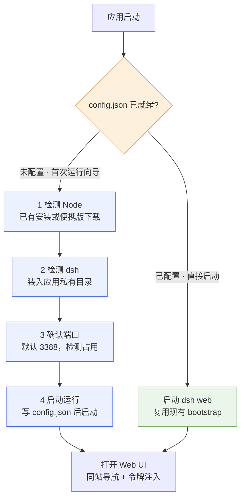

# DSH Desktop (Go)

[](LICENSE)
[](#环境要求)
[](https://go.dev)
[](https://wails.io)

**把 DeepSeek Harness 的网页界面变成双击即用的 Windows 桌面应用。**

**第一次运行会自己把环境配好** —— 检测 Node 与 dsh，缺什么当场补上（可从国内镜像自动下载），选好端口再启动。全程点几下鼠标，不用开终端；之后每次双击就是秒开。

不用记命令、不会挂着一个黑窗；关掉窗口只是收进托盘，在托盘右键才真正退出。

[English](README.en.md) · 简体中文 · [GitHub](https://github.com/Echosong/dsh-desktop-go) · [Gitee](https://gitee.com/hn-1024_0/dsh-desktop-go)

---

## 它解决什么问题

dsh 用起来要在终端里敲 `dsh web`，然后自己复制它打印的带令牌地址到浏览器打开 —— 每次都要重复一遍。而直接把这个地址做成快捷方式是不行的：那个地址里的令牌是一次性的，dsh 重启就变了。

于是有了这个壳：双击图标，它替你拉起 dsh、等界面真正就绪、再把窗口切过去。后台没有任何可见的窗口，退出时也不会留下孤儿进程。

## 特性

- **双击即用** —— 自动拉起 `dsh web`，等 Web UI 真正连上服务后才显示窗口，不会看到白屏或错误页
- **首次运行自动配环境** —— 检测 Node 与 dsh，缺失或版本不够时自动安装（便携版 Node **免管理员权限**），选好端口再启动。详见[首次运行向导](#首次运行向导)
- **不碰你已有的环境** —— 已经有可用的 dsh 就直接用，什么都不装；全程不写系统 `PATH`
- **后台无窗口** —— dsh 与内部命令全部以 `CREATE_NO_WINDOW` 运行，任务管理器里看不到黑窗
- **托盘常驻** —— 关闭按钮只是收起窗口；左键托盘图标唤回，右键菜单退出
- **退出不留孤儿** —— Windows Job Object 兜底，应用崩溃或被强杀也会带走 dsh
- **不碰你的 Key** —— 不读取、不存储任何模型凭据（详见[安全说明](#安全说明凭据相关)）

> **这不只是个 dsh 壳。** 如果你想把**任何**跑在 `localhost` 上的 Web 服务（Ollama、Jupyter、本地控制台……）包成桌面应用，这里的启动时序、SameSite 坑、子进程管理和托盘实现都能直接拿去用 —— 见 [实现要点](#实现要点)。


## 快速开始

从 [Releases](https://github.com/Echosong/dsh-desktop-go/releases) 下载 exe，双击运行即可。

**不需要提前自己装 Node 或 dsh。** 首次启动会进入一个四步向导（检测 Node → 检测 dsh → 确认端口 → 启动），
缺什么当场补上，装的是便携版、不需要管理员权限。配好之后每次启动都直接进界面。

也可以从源码编译：

```bash
git clone https://github.com/Echosong/dsh-desktop-go
cd dsh-desktop-go
wails build -clean
# 产物：build/bin/DSH Desktop.exe
```

编译需要 Go 1.21+、Wails CLI v2.9+、gcc（MinGW-w64）。

## 首次运行向导

第一次启动（以及托盘菜单里主动进入「环境设置」）时，应用会先检查运行环境，四步走完再启动：



| 步骤 | 做什么 |
| --- | --- |
| 1 · 检测 Node | 枚举本机所有 Node（PATH 的每一项 + 常见安装目录 + 各 npm 前缀），逐个跑版本与运行时探针；缺合格的 Node 时可一键下载便携版 |
| 2 · 检测 dsh | 枚举所有 dsh 安装位置，并**实际执行一次** `dsh --version` 确认能跑起来；缺失时用配对的 Node 自动安装 |
| 3 · 确认端口 | 默认 `3388`，可改；实时检测是否被占用并显示占用者进程与 PID，可一键结束或自动挑一个空闲端口 |
| 4 · 启动 | 展示最终选定的 Node / dsh / 端口，确认后拉起 `dsh web` 并把窗口切过去 |

每一步都是「检测 → 报告 → 按需安装 → 复检」的幂等循环：已经满足的步骤显示绿勾，可以跳过；
每一步都可以「重新检测」，也可以手动指定路径 —— 向导只做建议，最终用哪个由你确认。

**Node 的版本下限是硬要求。** dsh 依赖 Node 22.14 才有的 `import.meta.main`，
低于这个版本（尤其是 22.0~22.13 之间）dsh 任何命令都会**零输出直接退出**，看起来像「装坏了」。
所以向导会把低于 22.14 的 Node 直接标为不可用，而不是放过去再让你猜为什么点不开。

配置写在 `%LOCALAPPDATA%\DSH Desktop\config.json`，记录最终选定的 Node 路径、dsh 入口、端口等。
想重跑向导：托盘右键「环境设置…」，或删掉这个文件再启动。

## 目录结构

```
dsh-desktop-go/
├── main.go                  Wails 入口：窗口、关闭拦截
├── app.go                   应用状态机：向导 / 启动 / 就绪 / 失败，导航驱动，事件推送
├── config.go                运行环境配置读写（%LOCALAPPDATA%\DSH Desktop\config.json，原子写）
├── dsh.go                   dsh 命令定位、子进程管理、端口探测、访问地址解析
├── setup.go                 首次运行向导：四步状态机 + 绑定给前端的接口
├── setup_types.go           向导相关的类型与常量（含错误码、兜底命令拼装）
├── env_probe.go             Node / dsh / 端口的全量枚举探测（只读，带超时）
├── download.go              下载（断点续传 + sha256 校验）、解压、便携版 Node 与 dsh 的安装
├── env_probe_test.go        探测层单元测试 + TestDiagSetup 结果诊断
├── tray.go                  系统托盘（energye/systray）
├── jobobject_windows.go     Job Object 兜底：应用无论怎么消失都带走 dsh
├── frontend/dist/           启动页 + 首次运行向导（静态 HTML，无需 npm 构建）
│   ├── index.html
│   └── logo.png
├── build/
│   ├── appicon.png          1024x1024 源图（Wails 据此生成图标）
│   └── windows/icon.ico     多尺寸 Windows 图标（同时用作托盘图标）
├── docs/
│   ├── setup-wizard-plan.md     向导方案（形态选择、四步详设、安装策略、坑清单）
│   └── setup-wizard-design.md   向导实现级设计（数据结构、接口签名、事件协议、错误码、测试清单）
├── scripts/make_icon.py     图标生成脚本（DeepSeek 品牌蓝 + 鲸鱼）
├── scripts/diag_samesite.py 跨站/同站导航对照实验（复现并验证 SameSite 问题）
├── scripts/diag_redirect.py 验证 302 重定向无法绕开 SameSite 限制
├── scripts/diag_tray.py     用 WM_CLOSE 验证「关闭 → 收进托盘」行为
├── scripts/diag_console.py  枚举可见控制台窗口（验证无 cmd 黑窗）
├── scripts/diag_launch.py   以无控制台方式启动 exe（复现双击场景）
├── build.bat                一键编译
└── wails.json
```

## 安全说明（凭据相关）

本项目**不接触 DeepSeek 的 API Key**：代码里没有读取、存储或转发任何模型凭据，
key 由 dsh 自己管理（在 `~/.dsh/` 下，且 `settings.yaml` 里只有界面相关配置）。

代码里唯一出现 "token" 的地方，是解析 dsh 启动时打印的**本机会话令牌**：

```
dsh web: http://127.0.0.1:3388/?token=<一次性令牌>
```

它只对 `127.0.0.1` 回环地址有效、dsh 每次重启都会更换，且只存在于运行时内存与
本机日志文件里，不会被写进代码或打进 exe。`//go:embed` 只嵌入 `frontend/dist` 与 `icon.ico`。

如果要发布到公开仓库，注意以下几点：

| 内容 | 说明 |
| --- | --- |
| `build/bin/*.exe` | 编译产物，已在 `.gitignore` 中排除；要分发请走 Release 附件 |
| `*.log` | 应用日志含本机会话令牌与本机路径，已排除；`%LOCALAPPDATA%\DSH Desktop\app.log` 在项目外，不要手动拷进来 |
| 诊断脚本 | 已改为自动探测 dsh / exe / 浏览器，可用 `DSH_BIN`、`DSH_EXE`、`DSH_EDGE`、`DSH_NODE_DIR` 覆盖，脚本内不含本机绝对路径 |
| 工作区其他目录 | 本仓库应只包含 `dsh-desktop-go/`。若在上级目录初始化 git，注意 `D:\项目资料\ai实操\.workbuddy\` 里存有开发笔记（含本地数据库等口令）、以及 `ai-flow-agent/` 等无关项目，务必排除 |

## 环境要求

**运行**（最终用户）：

| 依赖 | 说明 |
| --- | --- |
| Windows | 10 / 11（x64） |
| WebView2 Runtime | Win10/11 一般已内置；向导不处理它，缺失需自行安装 |
| Node.js | **≥ 22.14**。缺失或版本过低时由向导自动装一个便携版 |
| dsh | `@deepseek-ai/dsh`。缺失时由向导自动安装 |

也就是说，**全新机器上你只需要 exe 本身**：Node 与 dsh 都交给向导。

**编译**（开发）：

| 依赖 | 说明 |
| --- | --- |
| Go | 1.21+ |
| Wails CLI | `v2.9.x` |
| gcc | 编译 WebView2 binding 需要（MinGW-w64 即可） |

Go 依赖：`github.com/wailsapp/wails/v2` v2.9.2、`github.com/energye/systray` v1.0.3（托盘）。
测试：`go test .`（探测层断言）；`go test -run TestDiagSetup -v .` 会打印本机环境探测结果，便于与 `where node` / `where dsh` / `netstat` 对照。

## 编译

```bat
build.bat
```

或手动：

```bash
export PATH="/e/goapp/bin:/e/goproject/bin:/c/Users/Administrator/AppData/Local/Microsoft/WinGet/Packages/BrechtSanders.WinLibs.POSIX.UCRT_Microsoft.Winget.Source_8wekyb3d8bbwe/mingw64/bin:$PATH"
cd dsh-desktop-go
wails build -clean
```

产物：`build/bin/DSH Desktop.exe`

> 必须用 `wails build`，不要直接 `go build`，否则前端资源不会被打进可执行文件。

## 运行与配置

直接双击 exe 即可。可用环境变量调整行为：

| 变量 | 默认值 | 说明 |
| --- | --- | --- |
| `DSH_WEB_PORT` | `3388` | dsh web 监听端口。**设置后会锁定端口**，向导里的端口输入框会被禁用 |
| `DSH_BIN` | 自动探测 | 指定 dsh 命令，可指向 `dsh.cmd` / `dsh.exe` / `bin.js` |
| `DSH_DEBUG` | 未设置 | 设为 `1` 时每 5 秒写一次存活心跳，便于排障 |

端口的生效优先级是 `DSH_WEB_PORT` 环境变量 > `config.json` > 默认 `3388`。

### 配置文件

`%LOCALAPPDATA%\DSH Desktop\config.json`（由首次运行向导写入，可手删以重跑向导）：

```json
{
  "setupCompleted": true,
  "nodePath": "D:\\soft\\nodejs\\node.exe",
  "nodeVersion": "22.23.2",
  "nodeSource": "existing",
  "npmPrefix": "D:\\soft\\nodejs",
  "dshBin": "D:\\soft\\nodejs\\node_modules\\@deepseek-ai\\dsh\\lib\\bin.js",
  "dshKind": "js",
  "dshVersion": "0.1.5-rc.1",
  "dshSource": "existing",
  "port": 3388,
  "mirror": "npmmirror"
}
```

向导选定后，启动 dsh 会**直接用这里的 `nodePath + dshBin` 组合**，不再去 `PATH` 里猜 ——
机器上有多个 Node 时，这是避免选错的关键。

### 运行日志

`%LOCALAPPDATA%\DSH Desktop\app.log`

记录应用启动、dsh 启动命令、抓到的访问地址、子进程退出等关键事件（超过 2MB 自动重置）。生产模式 exe 没有控制台，排查问题时先看这个文件。

### 交互说明

- 启动页会实时显示 `dsh web` 的输出日志；就绪后应用会自动把窗口带到 Web UI。
- 切换过程中窗口会短暂隐藏（约 1~3 秒），避免露出 dsh 的鉴权拦截页，之后直接显示加载好的 Web UI。
- 启动失败时（例如端口被占用）启动页会出现「重试 / 在浏览器中打开」两个按钮，重试会先结束占用端口的残留进程再重新拉起。

### 窗口与托盘

- **点窗口关闭按钮不会退出**，窗口收进右下角系统托盘，`dsh web` 继续在后台运行。
- 唤回窗口：**左键单击托盘图标**，或右键菜单中的「显示主窗口」。
- **只有右键托盘图标 → 退出** 才会真正结束程序，并一并结束它拉起的 dsh 进程。

托盘菜单：

| 菜单项 | 作用 |
| --- | --- |
| 显示主窗口 | 唤回窗口 |
| 在浏览器中打开 | 用系统默认浏览器打开 Web UI |
| 重新加载页面 | 重新加载当前 Web UI |
| 重启 dsh web | 结束占用端口的残留进程后重新拉起 dsh |
| 环境设置… | 回到首次运行向导重新检测环境（**会先结束当前 dsh 会话**，配好后自动重启） |
| 退出 | 真正退出应用并清理 dsh 进程 |

> 向导期间点窗口关闭按钮**就是退出**（不会收进托盘）—— 此时窗口是唯一的交互界面，收起会让人以为配置完了。安装进行中会先弹一次确认，避免误关中断安装。

> Wails v2 本身没有系统托盘 API（v2.9 ~ v2.12 均无），这里用 `github.com/energye/systray` 在独立线程里实现。

### 向导相关问题

**向导说我的 Node「不可用」并提示版本过低** —— dsh 需要 **Node ≥ 22.14**。低于这个版本（尤其 22.0~22.13）
dsh 任何命令都会**零输出直接退出**，看起来像「装坏了」，所以向导会直接拦下。点「自动安装 Node」装一个便携版即可，
也可以手动指定一个 22.14 以上的 `node.exe`。

**我机器上有好几个 Node，向导选了哪个？** —— 向导会把 `PATH` 里的每一项、常见安装目录以及各 npm 前缀里的 node
**全部列出来**（不是只取第一个），逐个跑版本与运行时探针。如果 dsh 装在某个 Node 的全局前缀下，会自动选中那一个，
避免两者错配；列表里可以随时自己切换。

**「自动安装 dsh」失败了** —— 向导底部会实时显示完整的 npm 日志。失败时会给出一条可复制的手动命令，两个要点：
必须用**配对的** node 调 `npm-cli.js`（不要用裸 `npm` —— 机器上有多个 node 时，它的全局前缀未必指向你想要的位置），
并且必须带 `--allow-scripts=...`（不带的话装完「看着成功」，但终端与子进程能力会缺失）。

**向导会不会把我已有的环境装乱？** —— 不会。原则是「全机只留一份」：已经有可用的 dsh 就直接用，什么都不装；
有 Node 但没有 dsh 时，优先装到该 Node 自己的全局目录（和你的其他全局包放一起）；只有用向导下载的便携版 Node 时，
才装到 `%LOCALAPPDATA%\DSH Desktop\runtime\` 下，删目录即卸载。全程不写系统 `PATH`、不改动任何已有安装。

**想重跑向导** —— 托盘右键「环境设置…」，或删掉 `%LOCALAPPDATA%\DSH Desktop\config.json` 再启动。

### 如果看到 “dsh web authentication required”

正常启动流程下这个页面不会显示给用户（切换期间窗口是隐藏的）。若仍然遇到：

1. 重新加载应用（托盘右键退出后重新打开 exe）—— 应用会自动重走导航并重新换取 Cookie；
2. 仍不行时，关闭应用后清掉 WebView2 的用户数据目录 `%APPDATA%\DSH Desktop.exe`，
   再启动应用（会以全新会话重新换取 Cookie）；
3. 排查依据：`%LOCALAPPDATA%\DSH Desktop\app.log`。

## 实现要点

**为什么不能直接加载 `http://localhost:3388/`。**

dsh web 启用了访问令牌（browser-trust fence）：不带令牌访问根路径会得到 `401`。启动成功后它会在标准输出打印真正的入口，形如：

```
dsh web: http://127.0.0.1:3388/?token=xxxxxxxx
```

所以应用的做法是：捕获子进程 stdout → 用正则取出带 `token=` 的地址。

**为什么不能从启动页直接跳到那个令牌地址（关键坑）。**

dsh 的会话 Cookie 是 `HttpOnly; SameSite=Strict`（见其 `sessionCookie()`），
而 Wails 的启动页运行在 `http://wails.localhost`，与 dsh 的 `http://127.0.0.1:3388`
**不是同一个 site**。SameSite 判定只看 scheme + 可注册域（端口不参与），
`wails.localhost` 与 `127.0.0.1` 属于不同 site，因此从启动页发起的跳转等于跨站导航，
Cookie 不会被携带 —— 浏览器会拿到 `401`，页面显示：

```
dsh web authentication required; reopen the URL printed by dsh web.
```

**正确做法是两步导航**（`app.go::navigateToUI`）：

1. 先导航到 dsh 自己的根地址 `http://127.0.0.1:<port>/`。这一步即使未授权也只是显示 401 文本页，
   但它把**文档带到了 dsh 自己的站**；
2. 再由这个同站文档发起带令牌的导航。此时属于同站导航，`SameSite=Strict` 的 Cookie 能正常种下并回传，
   dsh 的 UI 正常加载。

第 2 步只在页面确实停留在鉴权失败页时才补跳（脚本检查 `document.body.innerText` 是否含
`authentication required` 且带防重入标记），所以已经登录、Cookie 仍有效的情况下不会多跳一次。

**HTTP 302 重定向绕不过去。** 曾尝试让应用自己的路径返回 302 跳到令牌地址，
期望 Chrome 按规范在重定向链中改用当前 URL 的 site —— 实测不行，Chrome 会沿用最初的 initiator，
见 `scripts/diag_redirect.py`。因此中间那一两秒的鉴权拦截页在架构上无法避免。

**所以切换期间把窗口隐藏。** `navigateToUI` 在导航前调用 `runtime.WindowHide`，
然后以 200ms 粒度补跳，并通过「监听端口的进程上是否出现 ESTABLISHED 长连接」判断
UI 是否真正连上服务（dsh 界面加载成功会建立 WebSocket），确认后再 `WindowShow`。
实测隐藏时长约 1.5 秒，用户看到的是启动页直接变成 Web UI，不会看到任何错误页。

> 注意 host 必须前后一致：不要混用 `localhost` 和 `127.0.0.1`。
> dsh 的 Cookie 名由 authority 的哈希决定（`cookieName(authority)`），host 变了会被判为未授权。

这一行为由 `scripts/diag_samesite.py` 复现与验证：从 `localhost:9999`（异站）跳转时，
dsh 端口上没有任何长连接（停在 401 页）；从 `127.0.0.1:9999`（同站）跳转时，
5 秒内即出现 4 条 ESTABLISHED 长连接（UI 正常加载）。

**端口冲突处理。** 启动前先检测端口是否已被监听。被占用时不会盲目再起一个进程，而是直接给出提示，点“重试”会结束占用该端口的进程后重新拉起（适用于上次异常退出留下的残留实例）。

**进程清理。** 子进程以独立进程组启动，退出时用 `taskkill /T /F` 整棵树结束，避免 `cmd.exe → node` 中的 node 变成孤儿进程。

**子进程存活监控。** 就绪后会持续监听 dsh 进程的退出信号；一旦 dsh 意外挂掉，会把窗口拉回启动页并提示「重试」，而不是留一个打不开的死页面。

**不弹控制台黑窗。** 本应用是 GUI 程序，本身没有控制台；在这种进程里执行控制台程序时，Windows 会新建一个黑窗。所以启动 dsh 用的 `cmd.exe`（以及内部调用的 `netstat` / `taskkill`）全部以 `CREATE_NO_WINDOW | SW_HIDE` 启动。这不是小事：判断界面是否连上时每 200ms 就要调一次 `netstat`，不处理的话会不停闪黑窗，而启动 dsh 的 `cmd.exe` 更会一直挂在后面。

**退出时一定带走 dsh（两层保障）。**

1. 正常退出走 `OnShutdown` → `taskkill /T /F` 结束整棵进程树（子进程以 `CREATE_NEW_PROCESS_GROUP` 启动，保证 `cmd.exe → node` 一起结束，不留孤儿）。
2. 兜底用 **Windows Job Object**（`jobobject_windows.go`）：dsh 进程被纳入一个设置了 `JOB_OBJECT_LIMIT_KILL_ON_JOB_CLOSE` 的 job，只要应用消失——正常退出、崩溃、被任务管理器强杀都算——系统就会连带结束 dsh。实测直接 `taskkill /F` 强杀 exe（**不带** `/T`）后，dsh 端口立即释放。

   > Job 失败时不致命，会记一行日志，正常退出清理仍然有效。

**环境检测：不能用 `exec.LookPath`。**

`LookPath("node")` 只返回 `PATH` 里的**第一个**命中项。而用户机器上常有多个 Node（例如某个工具链自带的排在更前面），
只取第一个就可能得出「Node 在 A、dsh 在 B」的错乱结论 —— 本项目开发机上就真实存在这种情况（两个 Node，版本还不一样）。
所以向导是把 `PATH` 的每一项、常见安装目录与各 npm 前缀全部枚举出来，逐个校验后再交给用户确认。

**判定 Node 能不能用，靠运行时探针而不是版本号。**

dsh 的 `bin.js` 用了 `import.meta.main`，这个语法 Node **22.14** 才加入；低于该版本时 dsh 任何子命令都会
**零输出静默退出** —— 不报错、不打日志，表现为「点了没反应」，极难排查。所以除了比版本，还要实际跑一次：

```bash
node --input-type=module -e "console.log(import.meta.main)"   # 必须输出 true
```

另外，**单次执行失败未必代表不可用**（杀软扫描、首次运行被拦都可能让它偶发失败），所以探针失败会重试一次再判定 ——
否则会把可用的 Node 判成不可用，把用户往「重装一个」的错误方向推。

**dsh 的检测判据是「能跑起来」，不是「文件存在」。**

shim 可能坏掉、可能与所选 Node 不匹配、原生依赖可能缺失 —— 这些只有实际执行一次 `dsh --version` 才能发现。

**装 dsh 时的两个必须。**

```bash
{node}\node.exe {node}\node_modules\npm\bin\npm-cli.js install -g \
  --prefix "<prefix>" --registry=https://registry.npmmirror.com \
  --allow-scripts=@deepseek-ai/dsh-subprocess-local,koffi,node-pty,@google/genai,protobufjs \
  @deepseek-ai/dsh
```

用配对的 `node.exe + npm-cli.js` 直接调，绕开 `PATH`；`--allow-scripts` 不带的话，
`node-pty` / `koffi` 这类原生模块的 postinstall 不会执行，装完「看着成功」但终端与子进程能力缺失。
成功判据是输出末行的 `added N packages`（过程中的 `npm warn` 与 `cleanup failed` 都是正常的，
不要据此判断失败）。

**便携版 Node 装在用户态。**

从镜像下载（`npmmirror` 优先，失败回退官方源）→ 用 `SHASUMS256.txt` 校验 sha256 → 解压到临时目录 →
原子改名落位。全程不需要管理员权限，删目录即卸载；下载支持断点续传。

## 设计文档

| 文档 | 内容 |
| --- | --- |
| `docs/setup-wizard-plan.md` | 首次运行向导的方案：形态选择、四步详设、安装策略、必须踩住的坑 |
| `docs/setup-wizard-design.md` | 实现级设计：数据结构、接口签名、状态机、事件协议、错误码表、测试清单；§15 记录了实现时的偏差与原因 |

## 重新生成图标

```bash
python scripts/make_icon.py
```

图标为 DeepSeek 品牌蓝（`#4D6BFE`）圆角底 + 白色鲸鱼，输出 1024px PNG 与 6 种尺寸的 ICO。

## 诊断脚本

`scripts/` 下的脚本用于复现和验证本项目踩过的几个坑，都需要 Python 3.8+，
位置、dsh、浏览器均自动探测（可用 `DSH_BIN` / `DSH_EXE` / `DSH_EDGE` / `DSH_NODE_DIR` 覆盖）：

| 脚本 | 用途 |
| --- | --- |
| `diag_samesite.py` | 对照实验：跨站 vs 同站跳转，验证 SameSite=Strict 导致鉴权失败 |
| `diag_redirect.py` | 验证 HTTP 302 重定向无法绕开 SameSite 限制 |
| `diag_tray.py` | 用 `WM_CLOSE` 验证「点关闭 → 收进托盘」，并检查进程与端口状态 |
| `diag_console.py` | 枚举可见的控制台窗口，验证没有 cmd 黑窗 |
| `diag_launch.py` | 以无控制台（DETACHED_PROCESS）方式启动 exe，复现双击场景 |
| `make_icon.py` | 生成应用图标 |

> 环境检测（Node / dsh / 端口）的对照检查不在 `scripts/` 里，而是走 Go 测试 ——
> 直接测真实代码，而不是用另一种语言再实现一遍探测逻辑：
> `go test .` 跑断言，`go test -run TestDiagSetup -v .` 打印本机探测结果，便于与 `where node` / `where dsh` / `netstat` 对照。
